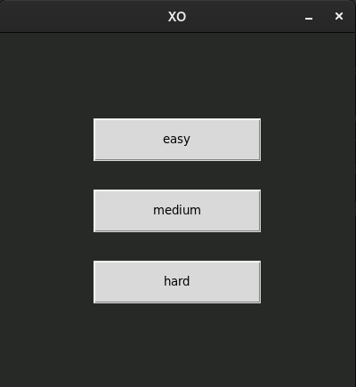
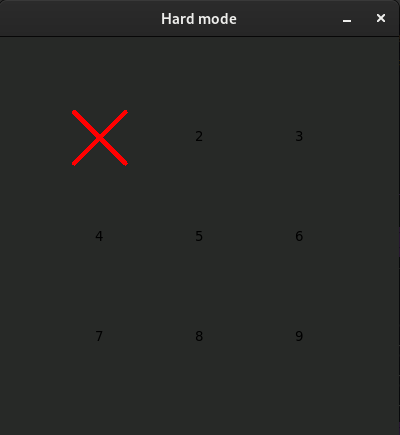
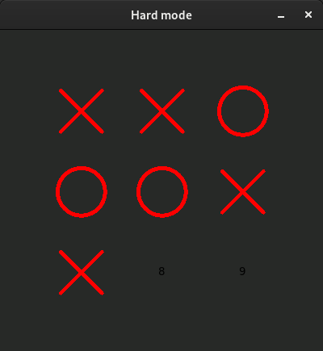
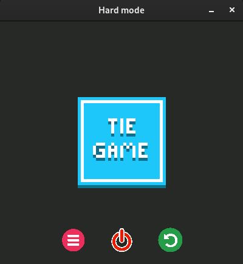
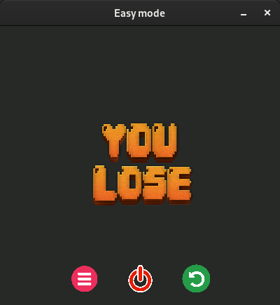
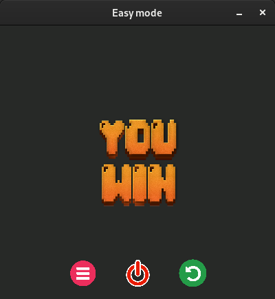

# XO

## About
A simple implementation of XO to learn python

The game has three difficulty levels:
- **Easy:** randomly selects an empty square
- **Medium:** If there is a possibility of winning or losing, it will make the right selection, otherwise it will choose a square randomly.
- **Hard:** Performs the best possible selection using artificial intelligence at each step. In this difficulty level, the minimax algorithm is used.

After selecting the difficulty level, the game will start and the result will be displayed at the end.
There is also a menu at the end that allows you to restart the game, return to the starting menu, or quit the game

## Dependencies
- **python3**
- **Tkinter**

## Gameplay

